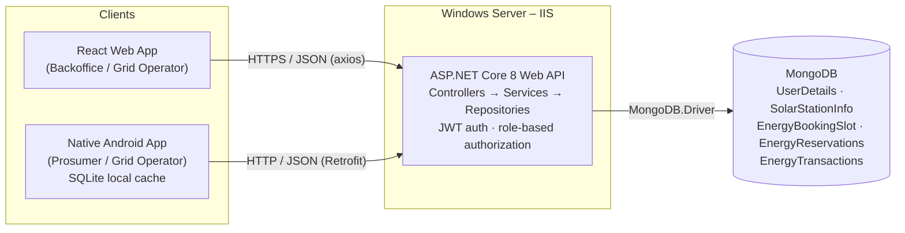
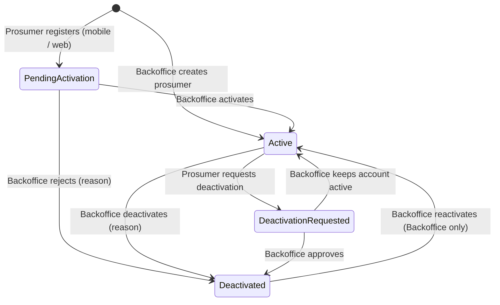

# ☀️ Smart Solar Microgrid Trading System

An end-to-end **client–server** system for trading solar energy in a community microgrid. Backoffice officers and grid operators work in a **React web application**, solar prosumers and grid operators use a **native Android application**, and both clients talk only to a central **C# ASP.NET Core Web API** hosted on **Windows IIS**, backed by **MongoDB**.

> SE4040 – Enterprise Application Development · Year 4 Semester 2 · 2026 · Assignment 1 (group of 4)
> BSc (Hons) in Information Technology Specialised in Software Engineering – SLIIT

| | |
|---|---|
| **Git repository** | https://github.com/DevFusion404/smart-solar-microgrid-trading-system |
| **Demo video (≤ 5 min)** | `https://youtu.be/1xV0fvgf11I` |
| **Project report** | Included in the submission zip |
| **Opening screen screenshot** | [`docs/screenshots/opening-screen.png`](docs/screenshots/opening-screen.png) |

---

## Table of contents

1. [Overview](#1-overview)
2. [System architecture](#2-system-architecture)
3. [Technology stack](#3-technology-stack)
4. [Features](#4-features)
5. [Business rules](#5-business-rules)
6. [Database design](#6-database-design)
7. [Repository structure](#7-repository-structure)
8. [Getting started](#8-getting-started)
9. [Deploying the API on IIS](#9-deploying-the-api-on-iis)
10. [API reference](#10-api-reference)
11. [Testing](#11-testing)
12. [Screenshots](#12-screenshots)
13. [Team and individual contributions](#13-team-and-individual-contributions)
14. [Development workflow](#14-development-workflow)
15. [Use of AI tools](#15-use-of-ai-tools)
16. [References](#16-references)

---

## 1. Overview

| Actor | Client | What they do |
|---|---|---|
| **Backoffice officer** | Web | Manages web users (Backoffice / Grid Operator), prosumer accounts (activate, deactivate, reactivate), microgrid nodes and schedules, and reservations. |
| **Grid operator** | Web + Android | Updates battery slot availability, monitors bookings, scans a prosumer's transaction QR code, verifies it with the server and completes the energy transfer. |
| **Solar prosumer** | Android | Registers with their NIC, manages their profile, reserves / modifies / cancels energy slots, views booking history and shows a secure QR code for approved bookings. |

Prosumers use only the Android app; the web portal is limited to Backoffice officers and Grid Operators.

All business logic lives in the API (**FAT service pattern**). The web and mobile applications are UI layers that communicate **only through REST calls**; neither client connects to the database.

---

## 2. System architecture



**API layering**

| Layer | Responsibility | Examples |
|---|---|---|
| Controllers | HTTP endpoints, `[Authorize(Roles = …)]` | `ProsumersController`, `StationsController` |
| Services | All business rules and validation | `ProsumerService`, `EnergyReservationService` |
| Repositories / DbContext | MongoDB access and indexes | `UserRepository`, `MongoDbContext` |
| Middleware | Consistent JSON error responses | `ExceptionHandlingMiddleware` |
| Authorization | JWT roles + NIC ownership policy | `NicOwnershipHandler` |

---

## 3. Technology stack

| Part | Technology |
|---|---|
| Web service | C# · ASP.NET Core 8 Web API · JWT Bearer auth · Swagger / OpenAPI · QRCoder |
| Database | MongoDB (MongoDB.Driver 3.x) |
| Hosting | Windows IIS (ASP.NET Core Hosting Bundle) |
| Web application | React 19 · Vite · Tailwind CSS 4 · React Router 7 · axios · Recharts · framer-motion · html5-qrcode |
| Mobile application | Pure native Android · Kotlin · XML layouts + ViewBinding · SQLite (`SQLiteOpenHelper`) · Retrofit · Coroutines · osmdroid (map) |
| Testing | xUnit (backend unit tests) · Postman collections |

---

## 4. Features

### 4.1 Web application

**Authentication and access control**
- Login with username or email; the JWT is stored and attached to every API call.
- The web portal is for **Backoffice** and **Grid Operator** accounts only. Role-based redirection after login: Backoffice → `/backoffice`, Grid Operator → `/operator`.
- Prosumer credentials are refused with a popup that points to the mobile app, and no web session is created.
- Route guard (`RequireRole`) blocks pages that the user's role may not open; expired sessions return to the login page.

**User management (Backoffice only)**
- Create, edit, deactivate (with reason) and reactivate **Backoffice** and **Grid Operator** accounts.

**Prosumer management (Backoffice)**
- Prosumer list with search (name / NIC / email) and status filter.
- Create a prosumer on behalf of a customer, view details and edit contact information.
- Review queues for **pending activations** and **deactivation requests**, also shown live on the Backoffice dashboard.
- Activate / reject registrations, deactivate accounts and **reactivate (Backoffice only)**.

**Microgrid node management**
- Create nodes with GPS coordinates, energy capacity (kW/h) and battery storage capacity.
- Update node details and operational schedules; deactivate / reactivate nodes (blocked while active reservations exist).
- Assign grid operators to nodes.

**Energy slots and reservations**
- Create and manage energy / battery slots and update slot availability (Grid Operator).
- Reservation list, status management and QR for approved bookings.

**Energy transfers (QR)**
- Grid Operator scans the QR, verifies it against the server, and completes or rejects the transfer.

**Account**
- Profile page and Account Settings (change password) for every role.

### 4.2 Android application

**Prosumer**
- Registration with **NIC as the unique key**, full name, username, email, phone, address and password (validated on the device and the server).
- Login with role-based home redirection, **pending activation** and **account deactivated** screens.
- View / edit profile, change password, **request account deactivation** with a summary screen.
- Dashboard, station list and map, reserve / modify / cancel energy slots, booking history, and QR code for approved bookings.

**Grid Operator**
- Operator dashboard, assigned nodes, map, slot availability updates and bookings.

**Local persistence (SQLite)**
- `sessions` table keeps the logged-in user and JWT. The saved login is restored on app start with no network call, so it also works offline. Mobile logins last **7 days** (`JwtSettings:MobileExpiryMinutes`; the web portal keeps `ExpiryMinutes`), then the session is cleared and the user signs in again. It is also cleared on logout.
- Stations, slots and reservations are cached locally for offline viewing.

### 4.3 Web service

- RESTful endpoints for every operation (see [API reference](#10-api-reference)).
- JWT authentication, role-based authorization and a NIC ownership policy so prosumers can only read their own data.
- Consistent error format: `{ errorCode, message, validationErrors, traceId, timestamp }`.
- Health check: `GET /health/db`.
- Swagger UI in development at `/swagger`.

---

## 5. Business rules

All rules are enforced in the API; the clients only repeat some checks for faster feedback.

| Area | Rule |
|---|---|
| Accounts | Prosumers register with a Sri Lankan NIC (9 digits + V/X, or 12 digits). NIC, username and email must be unique. |
| Accounts | Self-registered prosumers start as **PendingActivation** and cannot log in until a Backoffice officer activates them. |
| Accounts | Only **Backoffice** users can use administration functions and **reactivate** deactivated accounts. |
| Accounts | Deactivated accounts cannot log in. Deactivation and rejection reasons must be 10–500 characters. |
| Accounts | Passwords need at least 8 characters with an uppercase letter, a lowercase letter and a digit. |
| Nodes | A node cannot be deactivated while it has active energy reservations. |
| Reservations | Reservations must be within the next **7 days**. |
| Reservations | Updates and cancellations require at least **12 hours' notice**. |
| Reservations | A reservation cannot exceed the slot's available capacity. |
| Transfers | Transaction QR tokens are single-use and expire; invalid, expired or already-used QR codes are rejected. |

**Prosumer account lifecycle**



---

## 6. Database design

MongoDB database: `SmartSolarMicrogrid`

| Collection | Purpose | Key fields |
|---|---|---|
| `UserDetails` | All accounts (Backoffice, Grid Operator, Prosumer) | `_id`, `Nic` (prosumer key, unique sparse index), `FullName`, `Email` (unique), `PhoneNumber`, `Address`, `Username` (unique), `PasswordHash`, `Role`, `Status`, activation / deactivation audit fields, `CreatedAt`, `UpdatedAt`, `LastLoginAt` |
| `SolarStationInfo` | Microgrid nodes | station id, name, address, `Latitude`, `Longitude`, energy capacity, battery storage capacity, operational schedule, active flag, assigned operator |
| `EnergyBookingSlot` | Energy / battery slots per node | slot id, `StationId`, date, start and end time, total and available capacity, status |
| `EnergyReservations` | Prosumer bookings | reservation id, `ProsumerNic`, `StationId`, `SlotId`, date and time, energy amount, status, created / updated dates, QR token |
| `EnergyTransactions` | Energy transfer records | transaction id, reservation reference, QR token (unique), status, verification and completion details |

**Relationships:** `EnergyBookingSlot.StationId → SolarStationInfo`, `EnergyReservations.StationId / SlotId → station and slot`, `EnergyReservations.ProsumerNic → UserDetails.Nic`, `EnergyTransactions → EnergyReservations`.

---

## 7. Repository structure

```
smart-solar-microgrid-trading-system/
├── backend/                 ASP.NET Core 8 Web API
│   ├── Controllers/         REST endpoints
│   ├── Services/            Business logic (FAT service)
│   ├── Repositories/        MongoDB data access
│   ├── Models/  DTOs/       Entities and request / response contracts
│   ├── Authorization/       NIC ownership policy
│   ├── Middleware/          Global exception handling
│   ├── Data/                MongoDbContext, index creation, default admin seeder
│   └── Test/Postamn/        Postman collections
├── backend.Tests/           xUnit unit tests
├── frontend/                React + Vite + Tailwind web application
│   └── src/ (pages, components, services, context, utils)
├── mobile/                  Native Android application (Kotlin + SQLite)
│   └── app/src/main/ (java/com/smartsolar/mobile, res)
├── publish-iis.bat          IIS publish script
└── README.md
```

---

## 8. Getting started

### 8.1 Prerequisites

| Tool | Version |
|---|---|
| .NET SDK | 8.0 or later (the API targets `net8.0`) |
| MongoDB | Local MongoDB 6+ or a MongoDB Atlas cluster |
| Node.js | 20 or later (with npm) |
| Android Studio | Latest stable, JDK 17 or 21, Android SDK 34 (min SDK 26) |
| IIS | Windows IIS + ASP.NET Core Hosting Bundle 8 (for deployment) |

### 8.2 Web API

1. Create `backend/appsettings.Local.json` (git-ignored, never commit it):

   ```json
   {
     "MongoDbSettings": {
       "ConnectionString": "mongodb://localhost:27017",
       "DatabaseName": "SmartSolarMicrogrid"
     },
     "JwtSettings": {
       "SecretKey": "a-long-random-secret-of-at-least-32-characters"
     },
     "DefaultAdmin": {
       "Username": "admin",
       "Password": "ChangeMe123"
     }
   }
   ```

   `DefaultAdmin` creates the first Backoffice account on startup when no Backoffice user exists yet. The same values can be supplied as environment variables, e.g. `MongoDbSettings__ConnectionString`, `DefaultAdmin__Password`.

2. Run the API:

   ```bash
   cd backend
   dotnet run
   ```

3. Check it:
   - Swagger UI: http://localhost:5295/swagger
   - Database health: http://localhost:5295/health/db

MongoDB indexes (unique username / email / NIC, transaction and reservation indexes) are created automatically on first start.

### 8.3 Web application

```bash
cd frontend
npm install
npm run dev
```

Open http://localhost:5173. The API address defaults to `http://localhost:5295/api`; to change it create `frontend/.env`:

```
VITE_API_BASE_URL=http://<api-host>:<port>/api
```

Production build: `npm run build` (output in `frontend/dist`).

### 8.4 Android application

1. Open the `mobile/` folder in Android Studio and let Gradle sync.
2. Set the API address in `mobile/app/src/main/java/com/smartsolar/mobile/data/api/ApiConfig.kt`:
   - Emulator with the API on the same PC: `http://10.0.2.2:5295/`
   - Physical device: `http://<PC-LAN-IP>:5295/` (or the IIS site address)
3. If you use a new host over plain HTTP, allow it in `res/xml/network_security_config.xml`.
4. Run the `app` configuration on an emulator or device (Android 8.0 / API 26+).

### 8.5 Sample data

1. Log in to the web app as the default admin.
2. Create a Grid Operator (User Management) and a few microgrid nodes and slots.
3. Register prosumers from the mobile app, then activate them from **Prosumer Management → Activation / Deactivation Requests**.

---

## 9. Deploying the API on IIS

1. Install **IIS** (with the *Management Console*) and the **ASP.NET Core 8 Hosting Bundle**, then restart IIS (`iisreset`).
2. In IIS Manager create an application pool `SmartSolarPool` with **.NET CLR version: No Managed Code**.
3. Create a site pointing to `C:\inetpub\SmartSolarAPI`, using `SmartSolarPool`, bound to a port reachable by both clients (e.g. `http://*:8080`). Open the port in Windows Firewall.
4. Configure the connection string, JWT secret and default admin for the site as environment variables (Configuration Editor → `system.webServer/aspNetCore` → `environmentVariables`) or place an `appsettings.Local.json` in the site folder.
5. Publish:

   ```bash
   dotnet publish backend -c Release -o C:\inetpub\SmartSolarAPI
   ```

   or run `publish-iis.bat` as Administrator (edit the project path inside the script to match your machine). The script stops the app pool, publishes, and starts it again.
6. Verify `http://<server>:<port>/health/db`, then point the web (`VITE_API_BASE_URL`) and mobile (`ApiConfig.BASE_URL`) clients to the IIS address.

---

## 10. API reference

Base URL: `http://<host>:<port>` · All endpoints except login, prosumer registration and health require `Authorization: Bearer <JWT>`.

<details>
<summary><b>Authentication & profile</b></summary>

| Method | Endpoint | Access |
|---|---|---|
| POST | `/api/Auth/login` | Public |
| POST | `/api/Auth/logout` | Authenticated |
| GET | `/api/Auth/me` | Authenticated |
| GET / PUT | `/api/profile` (alias `/api/account/profile`) | Authenticated (own account) |
| POST | `/api/profile/change-password` | Authenticated |
| POST | `/api/profile/request-deactivation` | Prosumer |
</details>

<details>
<summary><b>Web users</b></summary>

| Method | Endpoint | Access |
|---|---|---|
| POST / GET | `/api/web-users` | Backoffice |
| GET / PUT | `/api/web-users/{username}` | Backoffice |
| POST | `/api/web-users/{username}/deactivate` · `/reactivate` | Backoffice |
</details>

<details>
<summary><b>Prosumers</b></summary>

| Method | Endpoint | Access |
|---|---|---|
| POST | `/api/prosumers/register` | Public |
| POST | `/api/prosumers` | Backoffice |
| GET | `/api/prosumers` · `/api/prosumers/search` | Backoffice, GridOperator |
| GET | `/api/prosumers/pending-activations` · `/deactivation-requests` | Backoffice |
| GET | `/api/prosumers/{nic}` | Owner, Backoffice, GridOperator |
| PUT | `/api/prosumers/{nic}` | Backoffice |
| POST | `/api/prosumers/{nic}/activate` · `/reject-activation` · `/deactivate` · `/reactivate` | Backoffice |
| POST | `/api/prosumers/{nic}/request-deactivation` | Prosumer (own NIC) |
| GET | `/api/prosumers/{nic}/status` | Backoffice, GridOperator |
</details>

<details>
<summary><b>Stations, slots and node assignment</b></summary>

| Method | Endpoint |
|---|---|
| POST / GET | `/api/stations` |
| GET / PUT | `/api/stations/{id}` |
| PUT | `/api/stations/{id}/schedule` · `/deactivate` · `/reactivate` |
| GET | `/api/stations/search` · `/api/stations/map` |
| POST / GET | `/api/stations/{stationId}/slots` |
| GET / PUT / DELETE | `/api/slots/{id}` |
| PUT | `/api/slots/{id}/capacity` · `/api/slots/{id}/close` |
| POST / DELETE | `/api/nodes/{nodeId}/assign-operator` · `/remove-operator` |
| GET | `/api/operators/{operatorId}/nodes` · `/api/nodes/{nodeId}/operator` |
</details>

<details>
<summary><b>Reservations</b></summary>

| Method | Endpoint | Access |
|---|---|---|
| POST / GET | `/api/reservations` | Prosumer |
| GET | `/api/reservations/history` | Prosumer |
| PUT / DELETE | `/api/reservations/{reservationId}` | Prosumer |
| GET | `/api/reservations/{reservationId}/qr` | Prosumer |
| GET | `/api/backoffice/reservations` | Backoffice |
| PATCH | `/api/backoffice/reservations/{reservationId}/status` | Backoffice |
| GET | `/api/backoffice/reservations/{reservationId}/qr` | Backoffice |
</details>

<details>
<summary><b>Energy transfers and dashboards</b></summary>

| Method | Endpoint | Access |
|---|---|---|
| POST | `/api/transactions/generate-qr` | Prosumer, Backoffice, GridOperator |
| GET | `/api/transactions/{transactionId}/qr` | Prosumer, Backoffice, GridOperator |
| GET | `/api/transactions/{transactionId}` · `/api/transactions/history/{prosumerNic}` | Authenticated |
| POST | `/api/transactions/verify-qr` | GridOperator, Backoffice |
| PUT | `/api/transactions/{transactionId}/complete` · `/reject` | GridOperator, Backoffice |
| GET | `/api/transactions/my` | Prosumer |
| GET | `/api/transactions/search` | Backoffice, GridOperator |
| GET | `/api/dashboard/summary` · `/api/dashboard/prosumer` · `/api/dashboard/operator` | By role |
| GET | `/health/db` | Public |
</details>

---

## 11. Testing

**Unit tests (xUnit)** – account services, validation rules and role authorization (no database needed):

```bash
dotnet test backend.Tests
```

Covers duplicate NIC rejection, NIC formats, incorrect password handling, pending / deactivated login restrictions, the full account lifecycle, Backoffice-only reactivation, profile update validation and password rules.

**API tests (Postman)** – import from `backend/Test/Postamn/`:

| Collection | Covers |
|---|---|
| `SmartSolarMicrogrid.postman_collection.json` | Stations, slots, health check |
| `Component1_IdentityAccount.postman_collection.json` | Login, roles, registration, account lifecycle, reactivation (run in order with the Collection Runner) |

---

## 12. Screenshots

> Add the screenshots to `docs/screenshots/` and update the paths below.

| Screen | Web | Mobile |
|---|---|---|
| Opening screen | `docs/screenshots/web-home.png` | `docs/screenshots/mobile-splash.png` |
| Login | `docs/screenshots/web-login.png` | `docs/screenshots/mobile-login.png` |
| Dashboard | `docs/screenshots/web-backoffice-dashboard.png` | `docs/screenshots/mobile-prosumer-dashboard.png` |
| Prosumer management / registration | `docs/screenshots/web-prosumers.png` | `docs/screenshots/mobile-register.png` |
| Nodes and map | `docs/screenshots/web-nodes.png` | `docs/screenshots/mobile-map.png` |
| Reservations | `docs/screenshots/web-reservations.png` | `docs/screenshots/mobile-reservations.png` |
| QR verification | `docs/screenshots/web-qr-scan.png` | `docs/screenshots/mobile-qr.png` |

---

## 13. Team and individual contributions

| Member | IT number | GitHub | Component | Branch |
|---|---|---|---|---|
| Imal Ayodya | `ITxxxxxxxx` | [@ImalAyodya](https://github.com/ImalAyodya) | 1 – Identity and Account Management | `feature/user_account_mgt` |
| Sithmaka Nanayakkara | IT22103918 | `TODO` | 2 – Microgrid Node, Energy Slot and Map Management | `microgrid-node-energy-slot-management` |
| Pasan Amarasinghe (Amarasinghe W.A.P.M) | `ITxxxxxxxx` | `TODO` | 3 – Energy Reservation and Booking Management | `Pasan-dev` |
| Malmi Bandara | IT22277886 | `TODO` | 4 – Dashboards, QR Verification and Energy Transfer Completion | `TODO` |

> Team: please confirm names, IT numbers, GitHub handles and component ownership before submitting.

### Component 1 – Identity and Account Management (Imal Ayodya)
- **API:** login / logout (JWT), role-based authorization (Backoffice, Grid Operator, Prosumer), web user CRUD, prosumer registration with NIC and duplicate-NIC validation, profile get / update, change password, deactivation request, pending activation and deactivation queues, activate / reject / deactivate / reactivate (Backoffice only), NIC ownership policy, global error handling, default Backoffice seeding.
- **MongoDB:** `UserDetails` collection and its unique indexes (username, email, NIC).
- **Web:** login and role-based redirection, route guard, user management, prosumer list / details / create, activation and deactivation requests, dashboard pending-requests panel, profile and account settings pages.
- **Android:** prosumer registration with NIC, login with role-based home, pending activation / deactivated / session-expired screens, profile edit, change password, deactivation request, SQLite session persistence.
- **Testing:** xUnit tests and the Component 1 Postman collection.

### Component 2 – Microgrid Node, Energy Slot and Map Management (Sithmaka Nanayakkara)
- **API:** node CRUD with GPS, capacity and battery storage, schedules, deactivation blocked by active reservations, station search and map coordinates, slot creation and availability, operator–node assignment.
- **MongoDB:** `SolarStationInfo` and `EnergyBookingSlot` collections.
- **Web:** node list, add / edit node, schedules, grid operator node and slot screens.
- **Android:** stations list and map with station details, operator nodes, map and slot management, local station caching.

### Component 3 – Energy Reservation and Booking Management (Pasan Amarasinghe)
- **API:** create / update / cancel reservations, slot capacity checks, 7-day booking window and 12-hour update / cancellation rules, Backoffice reservation management and reservation QR.
- **MongoDB:** `EnergyReservations` collection.
- **Web:** reservation list, details and status management.
- **Android:** reserve energy, my reservations (modify / cancel), booking history and QR for approved bookings.

### Component 4 – Dashboards, QR Verification and Energy Transfer Completion (Malmi Bandara)
- **API:** dashboard summary endpoints, secure QR generation and verification, transfer completion / rejection, transaction history and search.
- **MongoDB:** `EnergyTransactions` collection.
- **Web:** prosumer transaction dashboard and QR display, grid operator transfers, QR scanner, verification and completion pages.
- **Integration:** IIS deployment, API addresses in both clients, CORS, end-to-end testing and this README.

---

## 14. Development workflow

- Each member worked on their own feature branch and merged into `main` through pull requests.
- Commit messages describe the change (e.g. *"Add role-based route guard and login redirection to web app"*).
- Secrets (`appsettings.Local.json`, `.env`) are git-ignored; configuration is provided per machine or through IIS environment variables.
- Coding rules followed across the project: a comment header block on every `.cs` file and a comment at the start of every method.

---

## 15. Use of AI tools

This assessment is set at **AI Assessment Scale Level 2 (AI Planning)**. Each member's use of AI tools, and a short reflection, is disclosed in the *Individual contribution* section of the project report.

> Team: add a one-line summary per member here (tool used and for what), matching the report.

---

## 16. References

- ASP.NET Core documentation – https://learn.microsoft.com/aspnet/core
- Host ASP.NET Core on Windows with IIS – https://learn.microsoft.com/aspnet/core/host-and-deploy/iis
- MongoDB C# Driver – https://www.mongodb.com/docs/drivers/csharp/current/
- JWT Bearer authentication in ASP.NET Core – https://learn.microsoft.com/aspnet/core/security/authentication/jwt-authn
- xUnit.net – https://xunit.net/
- React – https://react.dev/ · Vite – https://vite.dev/ · Tailwind CSS – https://tailwindcss.com/
- React Router – https://reactrouter.com/ · axios – https://axios-http.com/
- html5-qrcode – https://github.com/mebjas/html5-qrcode
- QRCoder – https://github.com/codebude/QRCoder
- Android developers: SQLite – https://developer.android.com/training/data-storage/sqlite
- Retrofit – https://square.github.io/retrofit/
- osmdroid – https://github.com/osmdroid/osmdroid
- Material Design Icons (Apache 2.0) – https://github.com/google/material-design-icons
- Lucide icons – https://lucide.dev/

---

<sub>Developed for SE4040 Enterprise Application Development, SLIIT – 2026. For academic use.</sub>
